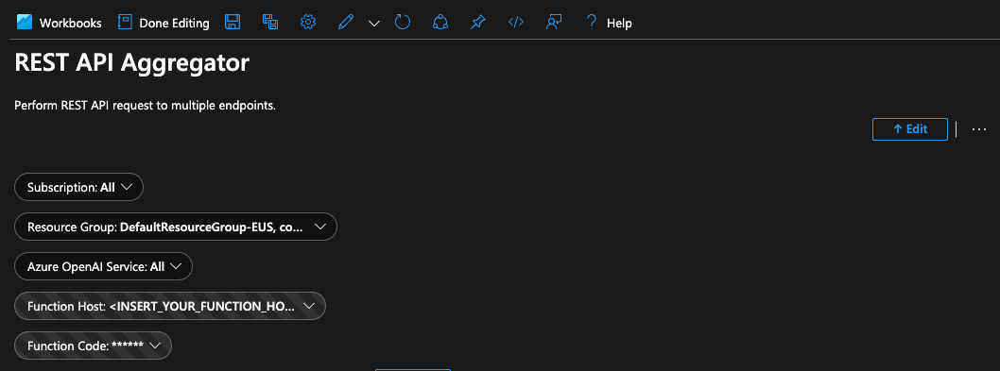
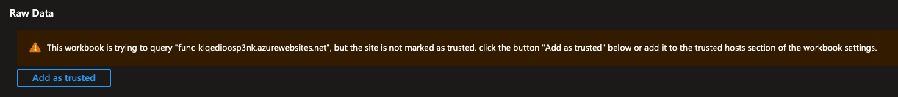
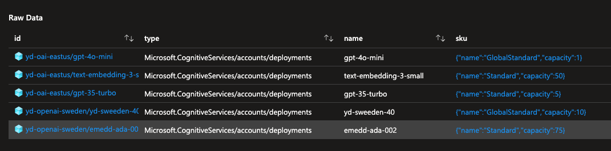
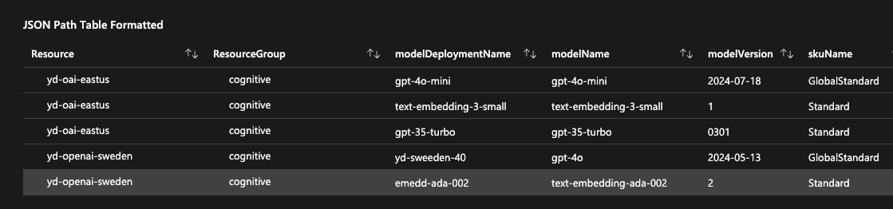
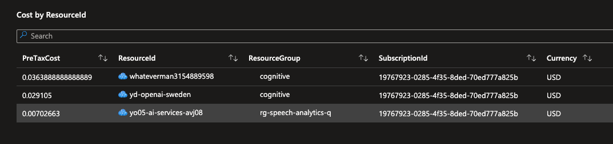
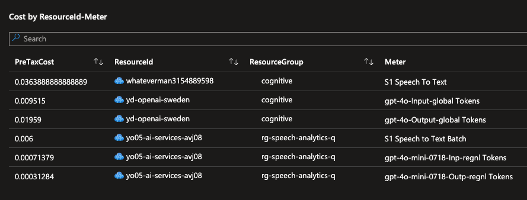

# Resource Inventory Gateway

## Overview

The Resource Inventory Gateway addresses a key limitation within Azure Workbooks, which currently supports only one ARM (Azure Resource Manager) call at a time. This limitation can make it cumbersome to aggregate data from multiple ARM resources, such as listing model deployments across several Cognitive Services accounts that may span multiple subscriptions and resource groups. The Resource Inventory Gateway automates these calls, aggregates the results, and returns a single response that can be easily consumed by an Azure Workbook.

The solution is packaged as an Azure Function, which can be deployed to your Azure subscription. The function is secured with a Managed Identity and supports querying multiple resources across different subscriptions, resource groups, and services. The function can also be used to query the Azure Cost Management API to get cost data for multiple subscriptions.

## Features

- **Multi-Resource ARM Querying**: Perform ARM API queries across multiple resources in different subscriptions, resource groups, and services.
- **Result Aggregation**: Consolidates results from multiple ARM calls into a single JSON response.
- **Workbook Integration**: Designed specifically to work around the single-call limitation in Azure Workbooks, enabling complex queries with ease.
- **CORS Support**: Configured to allow requests from any origin, making it versatile for various clients, including Azure Workbooks.
- **Cost API**: The function can be used to query the Azure Cost Management API to get cost data for multiple subscriptions.

### Security

This solution provide read access to your control plane, it uses a **Managed Identity** for secure and seamless authentication with `Azure Resource Manager` and `Azure Cost Management` APIs. The Managed Identity is assigned the `Reader` role on the entire subscription, management group or tenant. The deployment script will create a User-Assigned Managed Identity and assign it to the Function on the same subscription, additional subscriptions or management groups can be added to the Managed Identity.

Function - the function is secured with a key, a `key` and the `host` are values you will need to update in the workbook.

## How It Works

### ArmGateway Function

**Input Parameters**:

The function expects the following query parameters:

- **`armRoute`**: The ARM API route template, with parameters marked using `$`, such as `/subscriptions/$subscriptions/resourceGroups/$resourceGroups/providers/Microsoft.Web/sites/$sites`.
- **`resourceIds`**: A comma-separated list of resource IDs to be queried, such as `'/subscriptions/1234/resourceGroups/myGroup/providers/Microsoft.Web/sites/mySite1','/subscriptions/1234/resourceGroups/myGroup/providers/Microsoft.Web/sites/mySite2'`.

>Note: The marker `$` is used, as the `{}` is used by the workbooks to denote the parameters. The ARM route to be called, uses these markers to denote the parameters that need to be replaced with the actual values.

**Processing**:

- **Parameter Extraction**: The function extracts parameter names from the `armRoute` and matches them with corresponding parts in the `resourceIds`.
- **Route Generation**: For each resource ID, the function generates a complete ARM API route by replacing the placeholders in the `armRoute` with actual values.
- **API Execution**: The function concurrently executes the ARM API requests for all generated routes using the Managed Identity for authentication. The managed identity currently has `Reader` role on the entire subscription, management group or tenant.
- **Response Merging**: The results from all API calls are merged into a single JSON response, which is returned to the client. A new JSON element `_gateway` is added to the response, which contains the original parameters used for the request.

### CostGateway Function

> **Note**: The Azure COST Management API has tendency of throwing `429`.

**Input Parameters**:

- **`scope`**: a list of comma-separated scopes to query the cost data for, such as `/subscriptions/1234,/subscriptions/5678`. The function supports multiple scopes formats similar to the scopes defined [here](https://docs.microsoft.com/en-us/rest/api/cost-management/query/usage).
- **`body`**: the body of the request needs to follow the same format as the [Cost Management API](https://docs.microsoft.com/en-us/rest/api/cost-management/query/usage).

**Processing**:

- **Scope Extraction**: The function extracts the scopes from the `scope` parameter and generates a request for each scope with the same payload body.
- **API Execution**: The function concurrently executes the Azure Cost Management API requests for all generated scopes using the Managed Identity for authentication and getting an access token.
- **Merging Responses**: The results from all API calls are merged into a single JSON response, which is returned to the client. The current behavior perform a union and push all rows, since this is removing some of the information which earlier was on each response, the additional information (from the `id` field) is added to the response as a separate JSON element: `_gateway`. The values which would be populated in this element are derived from the `id` field.

### 3. Use Case Example

If you need to list all model deployments across several Cognitive Services accounts, spanning different subscriptions and resource groups, this function simplifies the task. Instead of making manual, one-by-one calls, the function automates the process and returns a consolidated response that can be directly used in an Azure Workbook.

## How to Use

### Deploying the Function

You can deploy the Resource Inventory Gateway to your Azure subscription using the provided deployment script. Follow these steps:

1. **Clone the Repository**:
   ```bash
   git clone https://github.com/Azure-Samples/resource-inventory-gateway
   cd resource-inventory-gateway
  ```
2. **Run the Deployment Script**:
   ```bash
   bash deploy-function.sh <resource-group-name> <location> [0/1]
   ```

   The script will:
   - Create a resource group and storage account.
   - Deploy the Azure Function App with the necessary configurations.
   - Assign a User-Assigned Managed Identity to the Function App.
   - Configure CORS to allow all origins.
   - The optional flag, would build the function locally if provided with `1`. if not provided or `0` it will use the latest release from the repo.
>Note: You need to be logged in to Azure CLI and have the necessary permissions to create resources in the subscription.

### Using the Function

Once deployed, you can use the function by making an HTTP GET request with the required query parameters:

**Request Example**:
```http
GET https://<your-function-app-name>.azurewebsites.net/api/ArmGateway?armRoute=/subscriptions/$subscriptions/resourceGroups/$resourceGroups/providers/Microsoft.Web/sites/$sites&resourceIds='/subscriptions/1234/resourceGroups/myGroup/providers/Microsoft.Web/sites/mySite1','/subscriptions/1234/resourceGroups/myGroup/providers/Microsoft.Web/sites/mySite2'
```

**Response Example**:
```json
{
  "value": [
    {
      "id": "/subscriptions/1234/resourceGroups/myGroup/providers/Microsoft.Web/sites/mySite1",
      "name": "mySite1",
      ...
    },
    {
      "id": "/subscriptions/1234/resourceGroups/myGroup/providers/Microsoft.Web/sites/mySite2",
      "name": "mySite2",
      ...
    }
  ]
}
```

### Adding Sample Workbook

- You should have the local copy of the workbook at this location: `resource-inventory-gateway/Workbook/REST API Aggregator.workbook`. Once loaded to azure it would look like below:



- The next step is to update the function key and the host, these values would be available in the function app view in Azure portal.
- Mark the host as trusted (this is a one time activity), this is required to make the function call from the workbook.



The workbook provided is intended as a sample it contains the following sections:
- **Raw Data**: This is the raw data from the function call



- **JSON Path table formatting**: showing how to pick & choose what to display from the raw data



- **Cost by resource id**: the body of the `cost` api call determines the data that is returned, this is a sample of the data that is returned when we seek billing information on cognitive services.



- **Cost by ResourceId and meter**: sometimes specific meter would have higher impact such as cost of tokens.



- **Cost of multiple resources groups**: this section shows how the information can be retrieved for multiple resource groups.

### Troubleshooting

- **CORS Issues**: Ensure that CORS is properly configured if you encounter any cross-origin request errors.
- **Authentication Failures**: Check that the Managed Identity is correctly assigned and has the necessary permissions (e.g., Reader role) in the subscription.

## Releases

When new features or bug fixes are introduced, a new release will be created. You can find the latest releases [here](https://github.com/Azure-Samples/resource-inventory-gateway/releases). Following are the steps required to update your current deployment with the latest release, there are two steps, the first is to download the latest zip, the second is to deploy it.

**Download the Latest Release**:

```bash
curl -L https://github.com/Azure-Samples/resource-inventory-gateway/releases/latest/download/functionapp.zip -o functionapp.zip
```
Here it downloads the `latest` release.

**Deploy the Latest Release**:

```az cli
az functionapp deployment source config-zip --resource-group <resource-group-name> --name <function-app-name> --src functionapp.zip
```

## Contribution

Contributions to the Resource Inventory Azure Function are welcome. Please fork the repository, make your changes, and submit a pull request. Ensure that your code is well-documented and tested.

## License

This project is licensed under the MIT License - see the [LICENSE](LICENSE) file for details.
